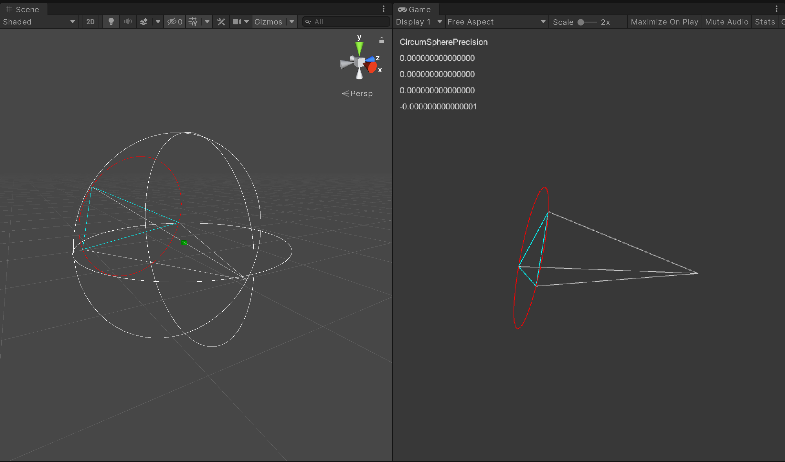

# unity-simplex-geometry

Simplex geometry utility library on 2D/3D. If you are looking for some circumCircle/circumSphere method on 2D/3D, this will help you.

## Usage

This library is based on Unity.Mathematics SIMD library, be sure to install them beforehand.

## License
[MIT](LICENSE)
